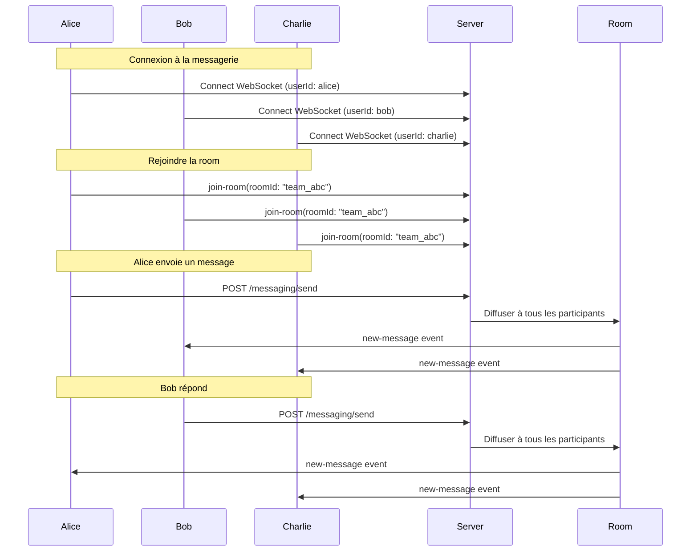

# 💬 Système de Messagerie MVP - OpenSource Together

## 📖 Vue d'ensemble

Ce système de messagerie MVP permet la communication temps réel entre **plusieurs utilisateurs** dans des **rooms partagées** via WebSockets. Chaque room peut contenir 2 ou plusieurs participants qui peuvent tous envoyer et recevoir des messages en temps réel.

## 🏗️ Architecture

- **Domain Layer** : Entités `Message` et `Room` avec validation métier
- **Use Cases** : Commands (SendMessage, CreateRoom) et Queries (GetMessages, GetRooms)
- **Infrastructure** : Service Prisma, Gateway WebSocket, Controller REST, Event Listeners

## 🎯 Concept Principal : Les Rooms

Une **room** est un espace de chat partagé où :

- ✅ **Plusieurs utilisateurs** peuvent se connecter simultanément
- ✅ **Tous les participants** voient les messages envoyés dans la room
- ✅ **Chaque participant** peut envoyer des messages que les autres reçoivent instantanément
- ✅ **La communication est bidirectionnelle** et en temps réel

## 🚀 Utilisation Complète - Exemple avec 4 Utilisateurs

### 1. Créer une Room avec Plusieurs Participants

```bash
POST /v1/messaging/rooms
Content-Type: application/json

{
  "participants": ["alice", "bob", "charlie", "diana"],
  "name": "Équipe Projet ABC",
  "description": "Room pour discuter du projet ABC"
}
```

**Réponse :**

```json
{
  "success": true,
  "data": {
    "id": "room_team_abc_1234",
    "name": "Équipe Projet ABC",
    "participants": ["alice", "bob", "charlie", "diana"],
    "createdAt": "2024-01-15T10:00:00.000Z"
  }
}
```

### 2. Connexion WebSocket Multi-Clients

**Chaque utilisateur se connecte à la messagerie :**

```javascript
// 👤 Alice se connecte
const aliceSocket = io('ws://localhost:4000/messaging', {
  query: { userId: 'alice' },
});

// 👤 Bob se connecte
const bobSocket = io('ws://localhost:4000/messaging', {
  query: { userId: 'bob' },
});

// 👤 Charlie se connecte
const charlieSocket = io('ws://localhost:4000/messaging', {
  query: { userId: 'charlie' },
});

// 👤 Diana se connecte
const dianaSocket = io('ws://localhost:4000/messaging', {
  query: { userId: 'diana' },
});
```

### 3. Rejoindre la Room (Tous les Participants)

**Chaque utilisateur rejoint la même room :**

```javascript
// Alice rejoint la room
aliceSocket.emit('join-room', { roomId: 'room_team_abc_1234' });

// Bob rejoint la room
bobSocket.emit('join-room', { roomId: 'room_team_abc_1234' });

// Charlie rejoint la room
charlieSocket.emit('join-room', { roomId: 'room_team_abc_1234' });

// Diana rejoint la room
dianaSocket.emit('join-room', { roomId: 'room_team_abc_1234' });
```

### 4. Écouter les Messages (Tous les Participants)

**Chaque client écoute les nouveaux messages :**

```javascript
// 🔔 Tous les participants écoutent les nouveaux messages
[aliceSocket, bobSocket, charlieSocket, dianaSocket].forEach((socket) => {
  socket.on('new-message', (message) => {
    console.log(
      `📩 Nouveau message de ${message.senderId}: ${message.content}`,
    );
    // Afficher le message dans l'interface utilisateur
  });

  socket.on('user-joined-room', (data) => {
    console.log(`👋 ${data.userId} a rejoint la room`);
  });

  socket.on('user-typing', (data) => {
    console.log(`⌨️ ${data.userId} est en train de taper...`);
  });
});
```

### 5. Envoyer des Messages (N'importe Quel Participant)

**Alice envoie un message :**

```bash
POST /v1/messaging/send
Content-Type: application/json

{
  "roomId": "room_team_abc_1234",
  "content": "Salut l'équipe ! Comment avance le projet ?",
  "messageType": "text"
}
```

**→ Bob, Charlie et Diana reçoivent instantanément :**

```javascript
// Tous les autres participants reçoivent :
{
  "id": "msg_123",
  "senderId": "alice",
  "content": "Salut l'équipe ! Comment avance le projet ?",
  "roomId": "room_team_abc_1234",
  "createdAt": "2024-01-15T10:05:00.000Z"
}
```

**Bob répond :**

```bash
POST /v1/messaging/send
Content-Type: application/json

{
  "roomId": "room_team_abc_1234",
  "content": "Ça avance bien ! J'ai terminé la partie frontend",
  "messageType": "text"
}
```

**→ Alice, Charlie et Diana reçoivent instantanément le message de Bob**

### 6. Exemple d'Une Conversation Complète

```javascript
// 💬 Conversation dans la room "room_team_abc_1234"

// Alice envoie
aliceSocket: "Salut l'équipe ! Comment avance le projet ?";
// → Bob, Charlie, Diana reçoivent

// Bob répond
bobSocket: "Ça avance bien ! J'ai terminé la partie frontend";
// → Alice, Charlie, Diana reçoivent

// Charlie ajoute
charlieSocket: "Super ! Moi j'ai fini l'API backend";
// → Alice, Bob, Diana reçoivent

// Diana indique qu'elle tape
dianaSocket.emit('typing', { roomId: 'room_team_abc_1234', isTyping: true });
// → Alice, Bob, Charlie voient "Diana est en train de taper..."

// Diana envoie
dianaSocket: 'Parfait ! On peut passer aux tests alors';
// → Alice, Bob, Charlie reçoivent
```

## 🔄 Flow Complet de Communication



## 📋 APIs REST

### Créer une Room Multi-Participants

```bash
POST /v1/messaging/rooms
{
  "participants": ["user1", "user2", "user3", "user4"],
  "name": "Ma Super Room",
  "description": "Description optionnelle"
}
```

### Envoyer un Message dans une Room

```bash
POST /v1/messaging/send
{
  "roomId": "room_id_123",
  "content": "Hello tout le monde !",
  "messageType": "text"
}
```

### Récupérer les Messages d'une Room

```bash
GET /v1/messaging/rooms/room_id_123/messages?limit=50&offset=0
```

### Récupérer les Rooms d'un Utilisateur

```bash
GET /v1/messaging/rooms?limit=20
```

## 🔌 WebSocket Events

### Events Émis par le Client

- `join-room` : Rejoindre une room
- `leave-room` : Quitter une room
- `typing` : Indiquer que l'utilisateur tape
- `get-room-users` : Demander les utilisateurs connectés

### Events Reçus par le Client

- `new-message` : Nouveau message dans la room
- `message-read` : Message marqué comme lu
- `user-typing` : Un utilisateur tape
- `user-joined-room` : Utilisateur a rejoint
- `user-left-room` : Utilisateur a quitté
- `user-online-status` : Statut en ligne/hors ligne

## 🧪 Test Complet avec 3 Utilisateurs

```bash
# 1. Créer une room avec 3 participants
curl -X POST http://localhost:4000/v1/messaging/rooms \
  -H "Content-Type: application/json" \
  -d '{
    "participants": ["alice", "bob", "charlie"],
    "name": "Test Room"
  }'

# 2. Alice envoie un message
curl -X POST http://localhost:4000/v1/messaging/send \
  -H "Content-Type: application/json" \
  -d '{
    "roomId": "room_id_returned_above",
    "content": "Hello les amis!"
  }'

# 3. Bob répond
curl -X POST http://localhost:4000/v1/messaging/send \
  -H "Content-Type: application/json" \
  -d '{
    "roomId": "room_id_returned_above",
    "content": "Salut Alice!"
  }'

# 4. Charlie ajoute son message
curl -X POST http://localhost:4000/v1/messaging/send \
  -H "Content-Type: application/json" \
  -d '{
    "roomId": "room_id_returned_above",
    "content": "Hey tout le monde!"
  }'

# 5. Récupérer tous les messages
curl http://localhost:4000/v1/messaging/rooms/{roomId}/messages
```

## ✅ Points Clés à Retenir

1. **🏠 Une Room = Plusieurs Participants** : Chaque room peut contenir 2+ utilisateurs
2. **🔄 Communication Bidirectionnelle** : Tous les participants peuvent envoyer ET recevoir
3. **⚡ Temps Réel** : Les messages sont instantanément diffusés à tous les connectés
4. **🎯 Ciblage par Room** : Les messages ne sont envoyés qu'aux participants de la room concernée
5. **📱 Multi-Client** : Chaque utilisateur peut avoir plusieurs connexions (mobile, web, etc.)

## 🚧 Limitations MVP

- **Authentification simplifiée** : userId via query params (à sécuriser)
- **Messages texte uniquement** : Pas de fichiers/images
- **Pas de notifications push** : WebSocket uniquement

Le système fonctionne parfaitement pour des rooms multi-participants en temps réel ! 🎉
