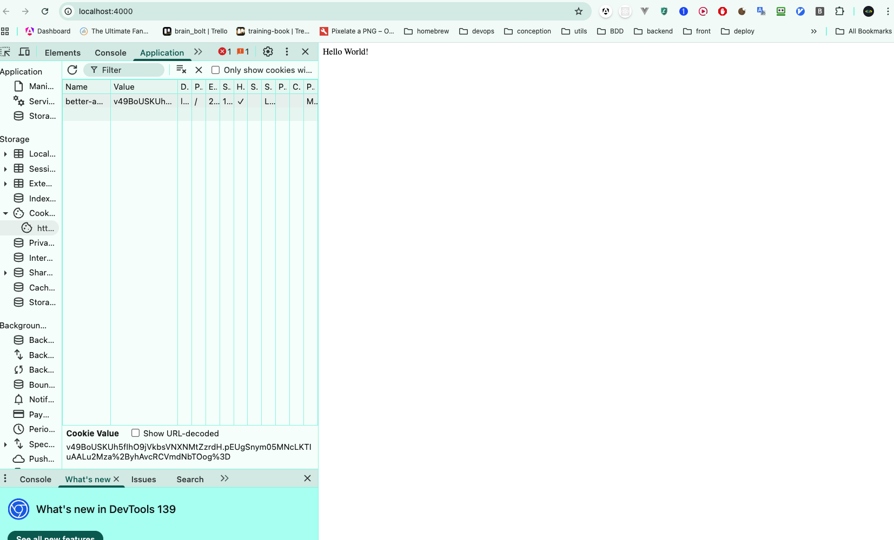
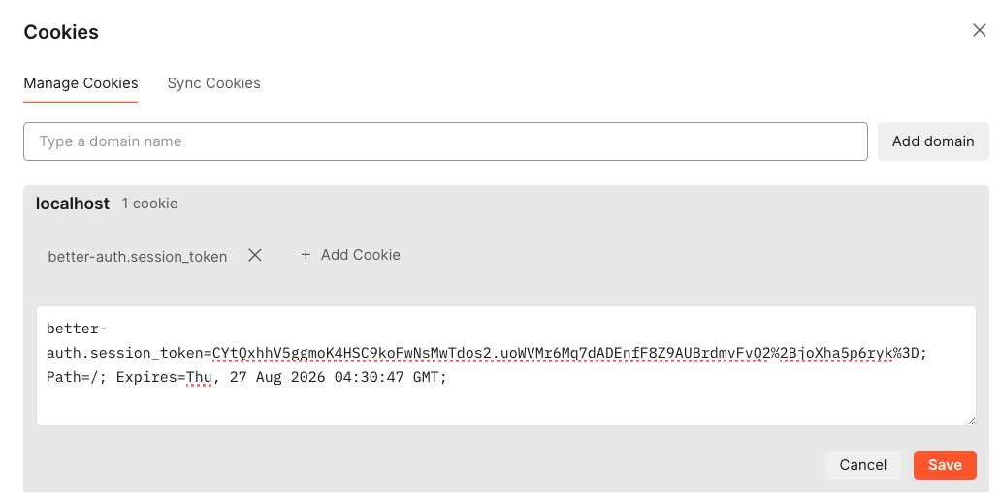

# GET STARTED Back end

## Pré requis:

- Node 22 ( Obligatoire, sinon vous aurez des erreurs à cause de la lib `Octokit` )
- Docker
- pnpm 10

## Démarage :

Après avoir clone le projet, faite la commande `pnpm i` dans le dossier `apps/server/`, une fois les dépendance installé, démarrer le container de la base de données avec Docker.
Veillez bien à avoir mis toutes les variables d'envrironnement nécéssaire comme présenté dans le `.env.example`.

### Base de données:

Lancer le docker compose de développement `docker-compose.dev.yml` pour la base de donnée :

- La première fois faite un build :

```bash
docker compose -f docker-compose.dev.yml up -d --build
```

- Pour les autres fois, un simple `up -d` suffit:

```bash
docker compose -f docker-compose.dev.yml up -d
```

### ORM

Une fois le container de la base de données lancer, effecuter les commandes de migrations nécéssaire : 

```bash
pnpm prisma:migrate:dev
```

## Authentication

Pour l'instant, on utilise la commande suivante pour récupérer le token nous permettant de faire les requêtes nécéssitant d'être authentifier :

```bash 
curl -X POST http://localhost:4000/api/auth/sign-in/social \
  -H "Content-Type: application/json" \
  -d '{"provider": "github"}' -v
```

En output si tout est ok vous aurez ceci :

```bash
Note: Unnecessary use of -X or --request, POST is already inferred.
* Host localhost:4000 was resolved.
* IPv6: ::1
* IPv4: 127.0.0.1
*   Trying [::1]:4000...
* Connected to localhost (::1) port 4000
> POST /api/auth/sign-in/social HTTP/1.1
> Host: localhost:4000
> User-Agent: curl/8.7.1
> Accept: */*
> Content-Type: application/json
> Content-Length: 22
> 
* upload completely sent off: 22 bytes
< HTTP/1.1 200 OK
< X-Powered-By: Express
< Vary: Origin
< Access-Control-Allow-Credentials: true
< content-type: application/json
< Date: Sat, 30 Aug 2025 13:42:31 GMT
< Connection: keep-alive
< Keep-Alive: timeout=5
< Transfer-Encoding: chunked
< 
* Connection #0 to host localhost left intact
{"url":"https://github.com/login/oauth/authorize?response_type=code&client_id=&state=hlkjhkljhjklhlkjhjkl&scope=read%3Auser+user%3Aemail+read%3Auser+user%3Aemail+repo+read%3Aorg&redirect_uri=http%3A%2F%2Flocalhost%3A4000%2Fapi%2Fauth%2Fcallback%2Fgithub","redirect":true}%   
```

Vous cliquer ensuite sur le lien de `url`, vous serez diriger vers cette page web :



Vous devrez alors allez dans la console du navigateur > application > better-auth.session_token > copier la valeur du cookie (le token)

Ensuite vous copier/coller cette valeur dans les Cookies de votre client http (exemple ici avec POSTMAN) :

