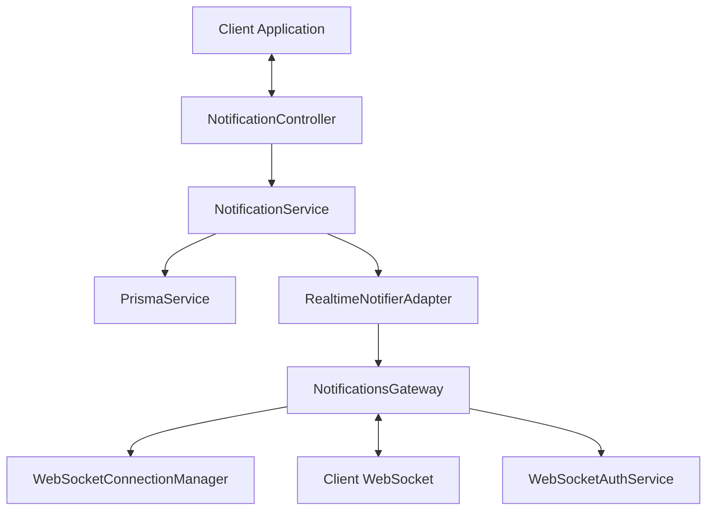
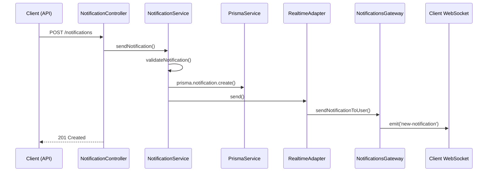
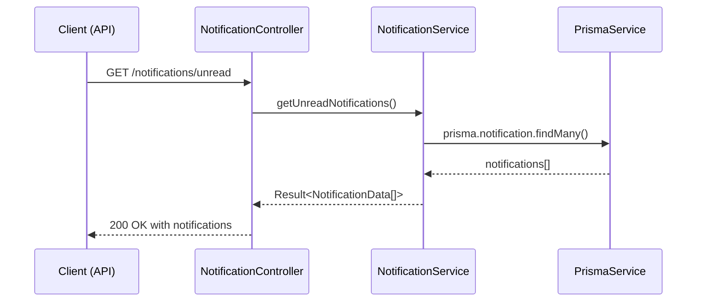
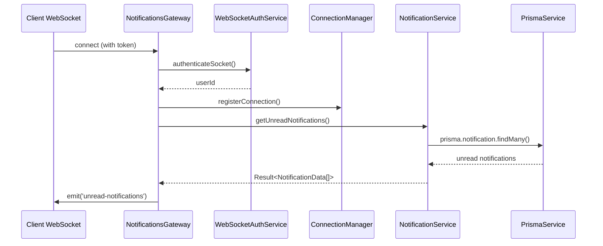

# Système de Notification

## Vue d'ensemble

Le système de notifications d'OpenSource Together est conçu pour permettre l'envoi de notifications temps réel aux utilisateurs via WebSocket, avec persistance en base de données. Il utilise une architecture modulaire et s'intègre parfaitement dans la nouvelle architecture backend.



## Composants Principaux

### 1. Domain

Le domain définit les structures de données et la validation métier.

**`notification.ts`**

```typescript
export interface NotificationData {
  id?: string;
  object: string;
  receiverId: string;
  senderId: string;
  type: string;
  payload: Record<string, unknown>;
  createdAt?: Date;
  readAt?: Date | null;
}

export function validateNotification(
  notification: Partial<NotificationData>,
): ValidationErrors | null {
  // Validation métier
}
```

Ce fichier contient:

- La structure de données fondamentale d'une notification
- La fonction de validation qui vérifie l'intégrité des données

### 2. Interfaces

Les interfaces définissent les contrats d'interaction entre les composants.

**`notification.service.interface.ts`**

```typescript
export interface NotificationServiceInterface {
  sendNotification(
    notification: SendNotificationPayload,
  ): Promise<Result<void, string>>;
  getUnreadNotifications(
    userId: string,
  ): Promise<Result<NotificationData[], string>>;
  // Autres méthodes...
}
```

**`notification.gateway.interface.ts`**

```typescript
export interface NotificationGatewayInterface {
  sendNotificationToUser(
    notification: NotificationData,
  ): Promise<string | null>;
  sendNotificationUpdate(
    notification: NotificationData,
  ): Promise<string | null>;
}
```

Ces interfaces:

- Définissent clairement les contrats entre les composants
- Permettent les tests avec des mocks
- Facilitent le couplage faible

### 3. Services

Les services implémentent la logique métier et les interfaces.

**`notification.service.ts`**

```typescript
@Injectable()
export class NotificationService implements NotificationServiceInterface {
  constructor(
    private readonly prisma: PrismaService,
    private readonly realtimeAdapter: RealtimeNotifierAdapter,
  ) {}

  async sendNotification(
    notification: SendNotificationPayload,
  ): Promise<Result<void, string>> {
    // Validation et persistance
    // Envoi via l'adaptateur realtime
  }

  // Autres méthodes...
}
```

**`realtime-notifier.adapter.ts`**

```typescript
@Injectable()
export class RealtimeNotifierAdapter {
  constructor(
    @Inject(forwardRef(() => NotificationsGateway))
    private readonly notificationsGateway: NotificationGatewayInterface,
  ) {}

  async send(notification: NotificationData): Promise<string | null> {
    return this.notificationsGateway.sendNotificationToUser(notification);
  }

  // Autres méthodes...
}
```

Ces services:

- Implémentent la logique d'affaires
- Coordonnent les interactions entre composants
- Gèrent les erreurs et la validation

### 4. Gateways

Les gateways gèrent les communications WebSocket.

**`notifications.gateway.ts`**

```typescript
@WebSocketGateway({
  namespace: 'notifications',
  cors: {
    origin: true,
    credentials: true,
  },
})
export class NotificationsGateway
  implements
    OnGatewayConnection,
    OnGatewayDisconnect,
    NotificationGatewayInterface {
  // Gestion des connexions WebSocket
  // Envoi des notifications
}
```

**`websocket-connection.manager.ts`**

```typescript
@Injectable()
export class WebSocketConnectionManager {
  private readonly userSockets = new Map<string, AuthenticatedSocket>();

  // Gestion des connexions d'utilisateurs
}
```

Ces composants:

- Gèrent les connexions/déconnexions WebSocket
- Authentifient les utilisateurs via JWT
- Distribuent les notifications aux clients connectés

### 5. Controllers

Les controllers exposent les endpoints REST API.

**`notification.controller.ts`**

```typescript
@ApiTags('Notifications')
@Controller('notifications')
export class NotificationController {
  constructor(
    @Inject(NOTIFICATION_SERVICE)
    private readonly notificationService: NotificationServiceInterface,
    private readonly wsAuthService: WebSocketAuthService,
  ) {}

  @Post()
  async create(
    @Session() session: UserSession,
    @Body() dto: CreateNotificationRequestDto,
  ): Promise<CreateNotificationResponseDto> {
    // Création d'une notification
  }

  // Autres endpoints...
}
```

Le controller:

- Expose les API REST pour gérer les notifications
- Convertit les DTOs en modèles de domain
- Gère la validation et les erreurs HTTP

### 6. DTOs

Les DTOs (Data Transfer Objects) définissent les structures de données pour l'API.

```typescript
// create-notification.request.dto.ts
export class CreateNotificationRequestDto {
  @ApiProperty({
    description: "L'objet de la notification",
    example: 'Nouveau projet',
  })
  @IsString()
  @IsNotEmpty()
  object: string;

  // Autres champs...
}
```

Les DTOs:

- Définissent la structure des requêtes et réponses API
- Incluent la validation et la documentation Swagger
- Séparent les préoccupations API des modèles de domaine

### 7. Module

Le module orchestre tous les composants.

**`notification.module.ts`**

```typescript
@Module({
  imports: [PrismaModule, WebSocketAuthModule],
  controllers: [NotificationController],
  providers: [
    NotificationService,
    NotificationsGateway,
    WebSocketConnectionManager,
    RealtimeNotifierAdapter,
    {
      provide: NOTIFICATION_SERVICE,
      useClass: NotificationService,
    },
  ],
  exports: [NOTIFICATION_SERVICE],
})
export class NotificationModule {}
```

Le module:

- Enregistre tous les composants du système
- Configure les dépendances
- Expose les services nécessaires pour d'autres modules

## Flux de Données

### 1. Création d'une Notification



### 2. Récupération des Notifications Non Lues



### 3. Connexion WebSocket et Synchronisation



## Utilisation du Service

### Envoyer une notification

```typescript
// Dans un autre service
@Injectable()
export class ProjectService {
  constructor(
    @Inject(NOTIFICATION_SERVICE)
    private readonly notificationService: NotificationServiceInterface,
  ) {}

  async createProject(data: CreateProjectDto, userId: string) {
    // Logique de création de projet...

    // Envoyer une notification
    await this.notificationService.sendNotification({
      object: 'Nouveau projet créé',
      senderId: 'system',
      receiverId: userId,
      type: 'project.created',
      payload: {
        projectId: newProject.id,
        projectTitle: data.title,
        message: `Votre projet "${data.title}" a été créé avec succès !`,
      },
    });

    return newProject;
  }
}
```

### Connexion côté client

```typescript
// Côté frontend
const socket = io('/notifications', {
  auth: { token: wsToken },
});

// Réception des notifications non lues à la connexion
socket.on('unread-notifications', (notifications) => {
  console.log('Notifications non lues:', notifications);
  // Mettre à jour l'interface utilisateur
});

// Réception d'une nouvelle notification
socket.on('new-notification', (notification) => {
  console.log('Nouvelle notification:', notification);
  // Afficher une alerte ou mettre à jour le compteur
});
```

## Alignement avec l'Architecture Backend

Le module notification s'aligne parfaitement avec la nouvelle architecture backend:

1. **Organisation Feature-First**: Tous les composants liés aux notifications sont regroupés dans un seul module
2. **Interfaces Claires**: Utilisation d'interfaces pour définir les contrats entre composants
3. **Inversion de Dépendance**: Utilisation de l'injection de dépendances pour un couplage faible
4. **Pattern Result**: Utilisation du pattern Result pour la gestion des erreurs
5. **Architecture Modulaire**: Le module peut être réutilisé et testé indépendamment
6. **Séparation des Préoccupations**: Chaque composant a une responsabilité unique et bien définie

Cette architecture facilite la maintenance, l'extension et le test du système de notification.
