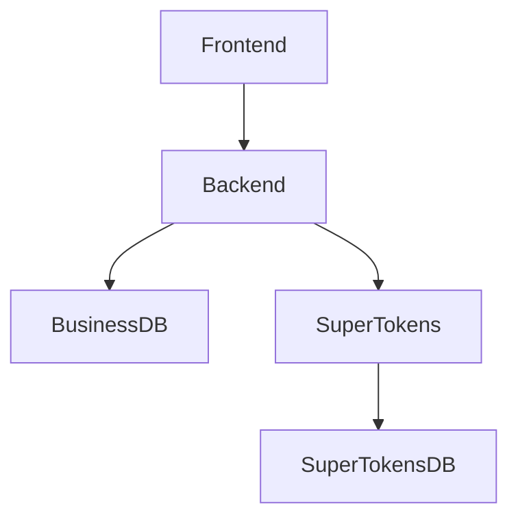

# OpenSource Together - Development Environment Documentation

## Architecture Overview

The application consists of 5 main services:

1. **Business Database** (PostgreSQL)
   - Port: 5432 (internal) / 5433 (external)
   - Purpose: Main application database
   - Container: business-db

2. **SuperTokens Database** (PostgreSQL)
   - Port: 5432
   - Purpose: Authentication data storage
   - Container: supertokens-db

3. **SuperTokens Core**
   - Port: 3567
   - Purpose: Authentication service
   - Container: supertokens

4. **Backend (NestJS)**
   - Port: 3000
   - Purpose: API server
   - Container: backend

5. **Frontend (Next.js)**
   - Port: 3000
   - Purpose: Web application
   - Container: frontend

## Service Dependencies



## Development Setup

### Prerequisites
- Docker and Docker Compose
- Node.js (recommended version: 22.x)
- pnpm (package manager)

### Initial Setup
```bash
# Clone the repository
git clone <repository-url>
cd opensource-together/apps

# Copy environment file
cp .env.example .env

# Install dependencies
pnpm install
```

### Starting the Development Environment
```bash
# Build and start all services
docker compose -f docker-compose.dev.yml up --build

# Or in detached mode
docker compose -f docker-compose.dev.yml up -d --build
```

### Installing New Dependencies
To install new dependencies and sync them between your local environment and the container:

```bash
# Install locally and in container
pnpm install --save package-name && pnpm docker:backend:update
```

### Database Management

#### Prisma Commands
```bash
# Generate Prisma client
pnpm prisma:generate

# Create and apply new migration
pnpm prisma:migrate:dev

# Deploy existing migrations
pnpm prisma:migrate:deploy

# Open Prisma Studio
pnpm prisma:studio
```

#### Database Access
```bash
# Business Database
docker exec -it business-db psql -U postgres -d app_database

# SuperTokens Database
docker exec -it supertokens-db psql -U postgres -d supertokens
```

### Development Tools

#### Hot Reload
The development environment is configured with hot reload for both frontend and backend:
- Backend code changes trigger automatic server restart
- Frontend changes are reflected immediately in the browser

#### Logs and Monitoring
```bash
# View all logs
docker compose -f docker-compose.dev.yml logs -f

# View specific service logs
docker compose -f docker-compose.dev.yml logs -f backend
docker compose -f docker-compose.dev.yml logs -f frontend
```

### Troubleshooting

#### Common Issues

1. **Port Conflicts**
```bash
# Check for port conflicts
lsof -i :3000  # Frontend/Backend
lsof -i :5432  # Databases
lsof -i :3567  # SuperTokens
```

2. **Database Connection Issues**
```bash
# Check database health
docker compose -f docker-compose.dev.yml ps
docker exec business-db pg_isready
docker exec supertokens-db pg_isready
```

3. **Container Management**
```bash
# Restart specific service
docker compose -f docker-compose.dev.yml restart backend

# Rebuild specific service
docker compose -f docker-compose.dev.yml up -d --build backend

# Clean restart
docker compose -f docker-compose.dev.yml down -v
docker compose -f docker-compose.dev.yml up --build
```

### Best Practices

1. **Version Control**
- Always version control Prisma migration files
- Never manually modify migration files
- Commit package.json and pnpm-lock.yaml together

2. **Environment Variables**
- Never commit .env files
- Keep .env.example updated with all required variables
- Document any new environment variables

3. **Dependencies**
- Use pnpm for consistent package management
- Update dependencies in both local and container environments
- Keep track of major version updates

## Additional Resources

- [NestJS Documentation](https://docs.nestjs.com)
- [Prisma Documentation](https://www.prisma.io/docs)
- [SuperTokens Documentation](https://supertokens.com/docs)
- [Docker Documentation](https://docs.docker.com)