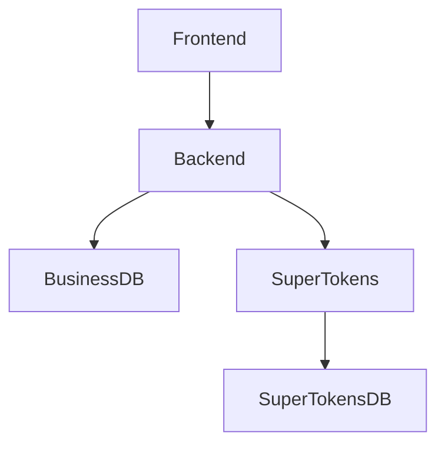

# OpenSource Together - Documentation de l'Environnement de Développement

## Vue d'Ensemble de l'Architecture

L'application se compose de 5 services principaux :

1. **Base de Données Métier** (PostgreSQL)
   - Port : 5432 (interne) / 5433 (externe)
   - Objectif : Base de données principale de l'application
   - Conteneur : business-db

2. **Base de Données SuperTokens** (PostgreSQL)
   - Port : 5432
   - Objectif : Stockage des données d'authentification
   - Conteneur : supertokens-db

3. **SuperTokens Core**
   - Port : 3567
   - Objectif : Service d'authentification
   - Conteneur : supertokens

4. **Backend (NestJS)**
   - Port : 3000
   - Objectif : Serveur API
   - Conteneur : backend

5. **Frontend (Next.js)**
   - Port : 3000
   - Objectif : Application web
   - Conteneur : frontend

## Dépendances des Services



## Configuration du Développement

### Prérequis
- Docker et Docker Compose
- Node.js (version recommandée : 22.x)
- pnpm (gestionnaire de paquets)

### Installation Initiale
```bash
# Cloner le dépôt
git clone <repository-url>
cd opensource-together/apps

# Copier le fichier d'environnement
cp .env.example .env

# Installer les dépendances
pnpm install
```

### Démarrage de l'Environnement de Développement
```bash
# Construire et démarrer tous les services
docker compose -f docker-compose.dev.yml up --build

# Ou en mode détaché
docker compose -f docker-compose.dev.yml up -d --build
```

### Installation de Nouvelles Dépendances
Pour installer de nouvelles dépendances et les synchroniser entre votre environnement local et le conteneur :

```bash
# Installation locale et dans le conteneur
pnpm install --save package-name && pnpm docker:backend:update
```

### Gestion de la Base de Données

#### Commandes Prisma
```bash
# Générer le client Prisma
pnpm prisma:generate

# Créer et appliquer une nouvelle migration
pnpm prisma:migrate:dev

# Déployer les migrations existantes
pnpm prisma:migrate:deploy

# Ouvrir Prisma Studio
pnpm prisma:studio
```

#### Accès aux Bases de Données
```bash
# Base de Données Métier
docker exec -it business-db psql -U postgres -d app_database

# Base de Données SuperTokens
docker exec -it supertokens-db psql -U postgres -d supertokens
```

### Outils de Développement

#### Hot Reload
L'environnement de développement est configuré avec le hot reload pour le frontend et le backend :
- Les changements de code backend déclenchent un redémarrage automatique du serveur
- Les changements frontend sont reflétés immédiatement dans le navigateur

#### Logs et Surveillance
```bash
# Voir tous les logs
docker compose -f docker-compose.dev.yml logs -f

# Voir les logs d'un service spécifique
docker compose -f docker-compose.dev.yml logs -f backend
docker compose -f docker-compose.dev.yml logs -f frontend
```

### Dépannage

#### Problèmes Courants

1. **Conflits de Ports**
```bash
# Vérifier les conflits de ports
lsof -i :3000  # Frontend/Backend
lsof -i :5432  # Bases de données
lsof -i :3567  # SuperTokens
```

2. **Problèmes de Connexion aux Bases de Données**
```bash
# Vérifier la santé des bases de données
docker compose -f docker-compose.dev.yml ps
docker exec business-db pg_isready
docker exec supertokens-db pg_isready
```

3. **Gestion des Conteneurs**
```bash
# Redémarrer un service spécifique
docker compose -f docker-compose.dev.yml restart backend

# Reconstruire un service spécifique
docker compose -f docker-compose.dev.yml up -d --build backend

# Redémarrage propre
docker compose -f docker-compose.dev.yml down -v
docker compose -f docker-compose.dev.yml up --build
```

### Bonnes Pratiques

1. **Contrôle de Version**
- Toujours versionner les fichiers de migration Prisma
- Ne jamais modifier manuellement les fichiers de migration
- Commiter package.json et pnpm-lock.yaml ensemble

2. **Variables d'Environnement**
- Ne jamais commiter les fichiers .env
- Maintenir .env.example à jour avec toutes les variables requises
- Documenter toute nouvelle variable d'environnement

3. **Dépendances**
- Utiliser pnpm pour une gestion cohérente des paquets
- Mettre à jour les dépendances dans les environnements local et conteneur
- Suivre les mises à jour majeures de version

## Ressources Additionnelles

- [Documentation NestJS](https://docs.nestjs.com)
- [Documentation Prisma](https://www.prisma.io/docs)
- [Documentation SuperTokens](https://supertokens.com/docs)
- [Documentation Docker](https://docs.docker.com)
