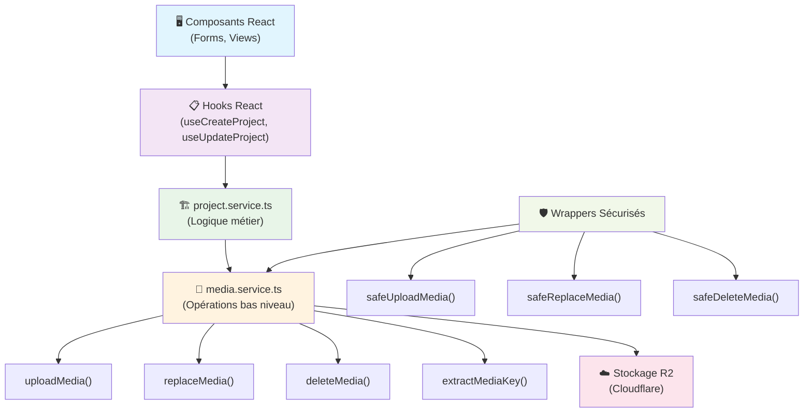

# OST-299 - Documentation Upload d'Images - OpenSource Together

## Vue d'ensemble

Cette documentation explique comment gérer l'upload, la modification et la suppression d'images dans le projet OpenSource Together. Le système utilise un service centralisé avec des wrappers sécurisés pour les opérations sur les médias.

## Architecture

Le système d'upload d'images est organisé en deux couches principales :

1. **media.service.ts** : Service bas niveau pour les opérations CRUD sur les images
2. **project.service.ts** : Service métier qui utilise media.service pour les projets

### Schéma de l'architecture



**Flux de données :**

- Les composants React utilisent les hooks pour déclencher les actions
- Les hooks appellent les services métier (project.service.ts)
- Les services métier utilisent les wrappers sécurisés de media.service.ts
- Les opérations finales sont exécutées sur le stockage R2

## Service Media (`media.service.ts`)

### Fonctions principales

#### `uploadMedia(file: File): Promise<MediaUploadResponse>`

Upload une nouvelle image vers le stockage R2.

```typescript
const response = await uploadMedia(imageFile);
console.log(response.url); // URL de l'image uploadée
```

#### `replaceMedia(oldKey: string, newFile: File): Promise<MediaUploadResponse>`

Remplace une image existante par une nouvelle.

```typescript
const oldKey = extractMediaKey(currentImageUrl);
const response = await replaceMedia(oldKey, newImageFile);
```

#### `deleteMedia(key: string): Promise<void>`

Supprime une image du stockage.

```typescript
const key = extractMediaKey(imageUrl);
await deleteMedia(key);
```

#### `extractMediaKey(mediaUrl: string): string`

Extrait la clé (nom de fichier) depuis une URL complète.

```typescript
const key = extractMediaKey("https://example.com/images/photo.jpg");
// Retourne: "photo.jpg"
```

### Wrappers sécurisés (recommandés)

Ces fonctions gèrent automatiquement les erreurs et offrent une expérience plus robuste :

#### `safeUploadMedia(file: File): Promise<string | null>`

Version sécurisée de l'upload qui retourne `null` en cas d'échec.

```typescript
const imageUrl = await safeUploadMedia(file);
if (imageUrl) {
  console.log("Upload réussi:", imageUrl);
} else {
  console.log("Upload échoué");
}
```

#### `safeReplaceMedia(currentImageUrl: string, newFile: File): Promise<string | null>`

Remplace une image avec fallback automatique :

1. Tente de remplacer l'image existante
2. En cas d'échec, upload la nouvelle et supprime l'ancienne
3. Retourne `null` si tout échoue

```typescript
const newImageUrl = await safeReplaceMedia(currentUrl, newFile);
```

#### `safeDeleteMedia(imageUrl: string): Promise<void>`

Suppression sécurisée qui n'échoue jamais (échec silencieux).

```typescript
await safeDeleteMedia(imageUrl); // Ne lève jamais d'erreur
```

## Service Projet (`project.service.ts`)

### Création de projet avec image

La fonction `createProject` gère automatiquement l'upload d'image :

```typescript
const project = await createProject(formData, imageFile);
```

**Comportement :**

- Upload l'image si fournie
- Crée le projet avec l'URL de l'image
- En cas d'échec, supprime automatiquement l'image uploadée

### Mise à jour de projet avec image

La fonction `updateProject` offre une gestion complète des images :

```typescript
await updateProject(
  updateData,
  newImageFile, // Optionnel : nouvelle image
  shouldDeleteImage // Optionnel : supprimer l'image actuelle
);
```

**Scénarios gérés :**

- **Nouvelle image uniquement** : Upload et remplacement automatique
- **Suppression d'image** : `shouldDeleteImage = true`
- **Remplacement d'image** : Fourni `newImageFile`
- **Aucun changement d'image** : Laisser les paramètres vides

### Suppression de projet

La fonction `deleteProject` nettoie automatiquement les images associées :

```typescript
await deleteProject(projectId);
```

## Intégration dans les composants React

### Hook de création

```typescript
const { createProject } = useCreateProject();

const handleSubmit = async (formData: ProjectFormData, imageFile?: File) => {
  createProject({
    projectData: formData,
    imageFile: imageFile,
  });
};
```

### Hook de mise à jour

```typescript
const { updateProject } = useUpdateProject();

const handleUpdate = async () => {
  updateProject({
    updateData: {
      data: formData,
      projectId: project.id,
    },
    newImageFile: selectedImageFile,
    shouldDeleteImage: shouldDelete,
  });
};
```

## Bonnes pratiques

### 1. Toujours utiliser les wrappers sécurisés

Préférez `safeUploadMedia`, `safeReplaceMedia`, et `safeDeleteMedia` aux fonctions de base.

### 2. Gestion d'état dans les formulaires

```typescript
const [selectedImageFile, setSelectedImageFile] = useState<File | null>(null);
const [shouldDeleteImage, setShouldDeleteImage] = useState(false);

const handleImageSelect = (file: File | null) => {
  if (file) {
    setSelectedImageFile(file);
    setShouldDeleteImage(false);
  } else {
    setSelectedImageFile(null);
    setShouldDeleteImage(true);
  }
};
```

### 3. Validation des fichiers

Validez toujours les fichiers côté client avant l'upload :

- Type de fichier (images uniquement)
- Taille maximale
- Dimensions si nécessaire

### 4. Gestion des erreurs

```typescript
try {
  const imageUrl = await safeUploadMedia(file);
  if (!imageUrl) {
    // Gérer l'échec d'upload
    showErrorMessage("Échec de l'upload de l'image");
    return;
  }
  // Continuer avec imageUrl
} catch (error) {
  console.error("Erreur inattendue:", error);
}
```

### 5. Nettoyage automatique

Les services gèrent automatiquement le nettoyage des images orphelines :

- En cas d'échec de création de projet
- Lors de la suppression de projet
- Lors du remplacement d'images

## Points d'attention

1. **Clés d'images** : Les clés sont extraites automatiquement des URLs, pas besoin de les gérer manuellement
2. **Fallback automatique** : `safeReplaceMedia` a un mécanisme de fallback intégré
3. **Échecs silencieux** : Les suppressions d'images échouent silencieusement pour éviter de bloquer les flux utilisateur
4. **Validation** : Les données sont validées avec Zod avant l'envoi à l'API

## Exemples d'utilisation complète

### Création de projet avec image

```typescript
const handleCreateProject = async (formData: ProjectFormData) => {
  const imageFile = getSelectedImageFile();

  try {
    await createProject({
      projectData: formData,
      imageFile: imageFile,
    });
    // Redirection automatique en cas de succès
  } catch (error) {
    // Gestion d'erreur avec toast automatique
  }
};
```

### Mise à jour d'image de projet

```typescript
const handleImageUpdate = async (newImageFile: File) => {
  try {
    await updateProject({
      updateData: {
        data: currentProjectData,
        projectId: projectId,
      },
      newImageFile: newImageFile,
      shouldDeleteImage: false,
    });
  } catch (error) {
    // Gestion d'erreur
  }
};
```
